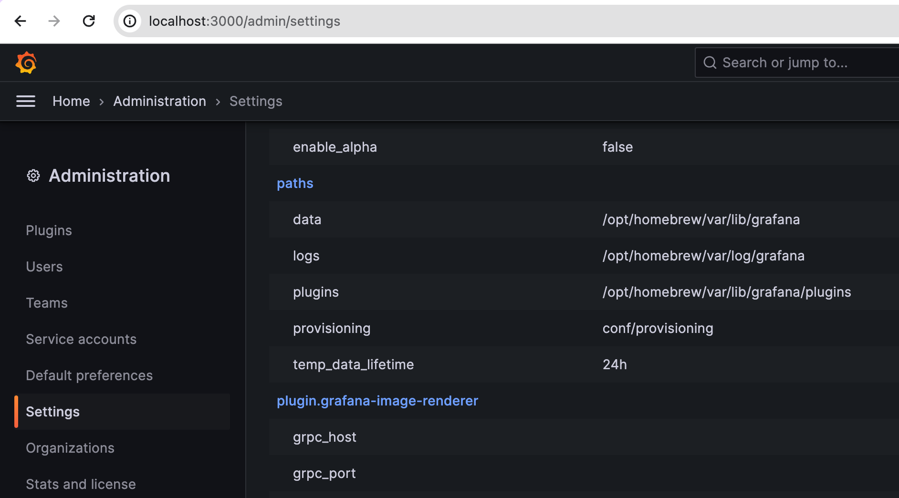
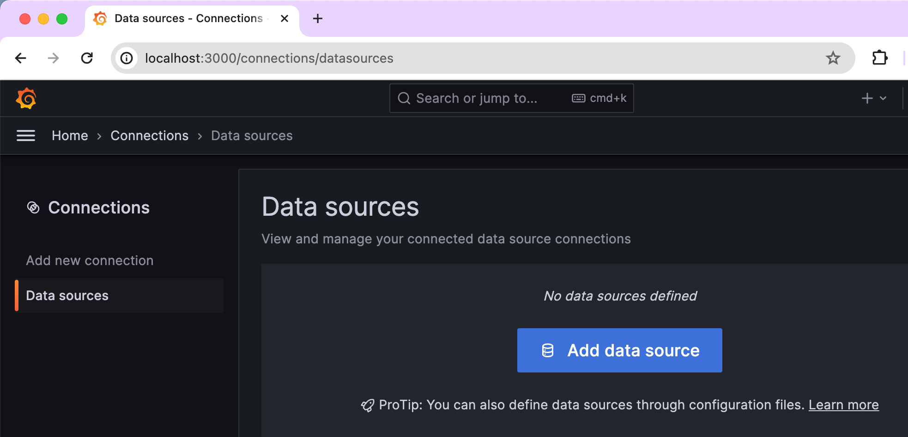
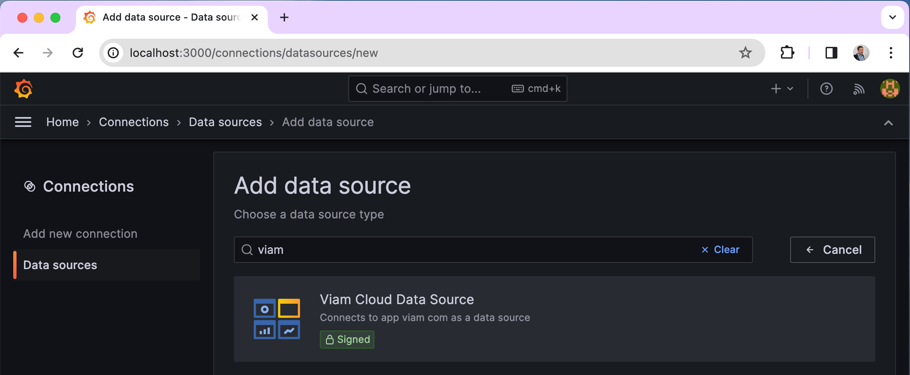
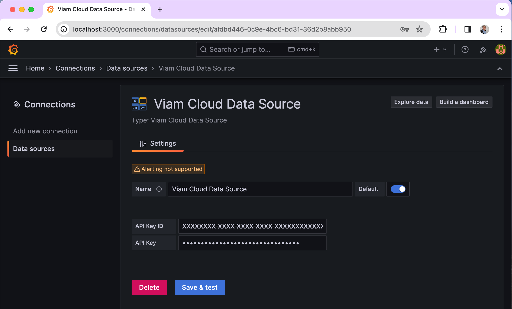

# Viam Grafana Data Source

This repo contains a simple Grafana data source allowing you to add app.viam.com as data source to create dashboards and dashlets visualizing your smart machines data. This is no production ready code but might be a good starter. Feel free to provide feedback and also happy to get pull requests for extensions and general improvements.

## Installation

Download the zip file from a release and unzip it into your Grafana "plugins" folder. If you don't know where to find it have a look at "Administration/Settings" in your Grafana instance as shown on the screenshot below.

## Configuration

Once the plugin is installed, you might have to restart the Grafana service. You can then simply add the data source as shown on the screenshots below:

